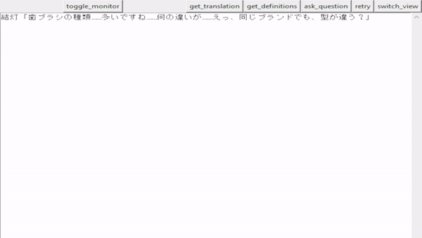

# instant_jp_vocab
Monitor the clipboard and generate vocabulary lists for Japanese sentences.
Useful with a text hooking utility like Textractor.

  
Live translations, vocabulary lists.

  
Ask questions, with the previous lines as context. Uses ctrl+enter as a shortcut.

## Setup
1. Install with `pip install -r requirements.txt` and `python -m unidic download`.
2. Edit `settings.toml` to enable what you want.
3. For AI behaviors, you can either set a Google Gemini API key in the settings file.  
   Or, install Oobabooga's Text-Generation-WebUI, enable the API and configure it in the settings file.
5. Start the app by entering `python -m jp_vocab_monitor_ui [story_name]`.

## Configuration
You can also configure the program by creating a `user.toml` in the root directory. Then, settings will be loaded from `settings.toml` first, with any overlapping values overridden by `user.toml`.

Per story configuration is also possible by adding a `[story_name].toml` in the `settings` folder.  
In particular, you can add synopsis to guide the AI with the `ai_translation_context` key.

## Suggested Models
I've seen decent translation quality with the following local models:  
[Command-R](https://huggingface.co/CohereForAI/c4ai-command-r-v01)  
[Mixtral-8x7B-instruct-cosmopedia-japanese20k](https://huggingface.co/aixsatoshi/Mixtral-8x7B-instruct-cosmopedia-japanese20k)  

If you're going to _ask_ the AI questions about Japanese, I'd recommend using Google's Gemini Pro via API (Gemini 1.5's accuracy is great; and the free-tier rate limiting should be fine for reading).

## Credits
For definitions and katakana readings in non-ML mode, we use a modified [Jitendex](https://github.com/stephenmk/Jitendex), which is under the [ShareAlike license](https://creativecommons.org/licenses/by-sa/4.0/).

For breaking sentences into words, we use [fugashi](https://github.com/polm/fugashi).
